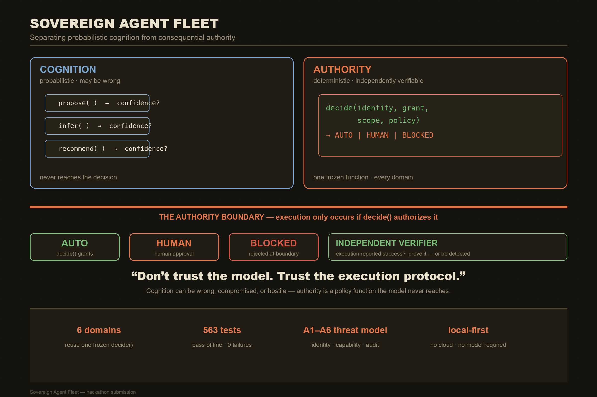

# Sovereign Agent Fleet

> **A sovereign cognitive control plane for governing probabilistic agents and consequential actions.**
>
> **Cognition is probabilistic. Authority is deterministic.**
> *The model proposes. The protocol decides. Cryptography verifies. The ledger remembers.*

**Sovereign Agent Fleet is not another multi-agent framework.** Frameworks orchestrate
agents. This *governs* them — and the governance is independent of *which* brain produced a
proposal (local LLM, cloud model, or a pure deterministic strategy).

Finance is the **flagship exemplar**, not the reason for existing. Few domains expose the
full arc so cleanly: probabilistic reasoning, mathematical inference, risk, consequential
actions, deterministic authorization, and independent verification — all under one roof. The
architecture underneath is **domain-general**: six independent workloads reuse the *same
frozen* authorization function with zero substrate edits.

📄 **Read the full research paper:** **[Sovereign Knowledge Systems](https://www.danielkliewer.com/paper)**  
🎬 **Watch the hackathon demo:** [`demo/hackathon_demo_1080p.mp4`](demo/hackathon_demo_1080p.mp4)  
🔗 **Live D17 approval console:** **[fleet-approval-console](https://fleet-approval-console-k2g74c4duq-uc.a.run.app/)** — fail-closed, read-public (see `DEPLOY_LIVE.md`)

[](https://github.com/kliewerdaniel/sovereign-agent-fleet/actions/workflows/ci.yml)
[](https://github.com/kliewerdaniel/sovereign-agent-fleet/actions/workflows/fleet-security.yml)
[](#evaluation-at-a-glance)
[](#license)
[](#quick-start)
[](https://www.danielkliewer.com/paper)

> **At a glance:** a **local-first**, **dependency-light** governance substrate (stdlib + `cryptography`/`pynacl`/`argon2-cffi`) that decides *every* consequential action through one frozen, deterministic, model-independent function — `fleet.epistemic.decide()`. **563 tests pass offline** (567 collected; 4 live-venue integration tests are deselected unless run with `-m network`). Fully simulated by default; **no API keys, no cloud, no network** required to run the suite.



---

## Table of contents

- [The one-line thesis](#the-one-line-thesis)
- [The problem](#the-problem)
- [The architecture](#the-architecture)
- [The invariants (the contract)](#the-invariants-the-contract)
- [Three trust domains](#three-trust-domains)
- [Security & threat model](#security--threat-model)
- [Evaluation at a glance](#evaluation-at-a-glance)
- [Repository layout](#repository-layout)
- [Quick start](#quick-start)
- [What's implemented](#whats-implemented)
- [The demonstration](#the-demonstration)
- [Research depth](#research-depth)
- [Roadmap & competition positioning](#roadmap--competition-positioning)
- [Community & project files](#community--project-files)
- [License](#license)

---

## The one-line thesis

> **Do not trust the model. Trust the execution protocol.**
>
> `MODEL OUTPUT ≠ AUTHORIZATION`

A confident model is not an *authorized* one. A correct model is not a *permitted* one.
An identity can be compromised and still be prevented from escalating authority. Evidence can
establish truth without granting permission. Sovereign Agent Fleet separates **cognition**
(what the model *believes*) from **authority** (what the system is *permitted* to do) from
**execution** (what *actually happened*) — and it keeps those three questions in separate
computational boundaries so an answer to one is never mistaken for an answer to another.

### Why this repo is different

| | Sovereign Agent Fleet | Typical agent framework |
|---|---|---|
| **Who decides consequential actions?** | One frozen, deterministic `decide()` function | The model, or a prompt-driven controller |
| **Is a confident model an authorization?** | No — `ModelOutput ≠ Authorization` (Invariant 1) | Implicitly, yes |
| **Can a compromised identity escalate?** | No — Ed25519 cert chain + pinned-issuer grant verify | Depends on app code |
| **Does the executor's "success" get trusted?** | No — an independent verifier recomputes state | Often, yes |
| **Is the audit record tamper-evident?** | Yes — signed hash chain, fail-closed verify | Usually a plain log |
| **Does governance need the model at all?** | No — meta-invariant **M0** holds even with a malicious brain | The model *is* the governance |
| **Runtime dependencies** | stdlib + `cryptography`/`pynacl`/`argon2-cffi` | LLM SDKs, vector DBs, orchestration |

---

## The problem

Modern agentic systems combine powerful probabilistic reasoning with increasingly
consequential actions. The persistent architectural error is to place model-generated
decisions on the critical path between cognition and consequential action — implicitly
treating probabilistic inference as authorization.

Reasoning is not authority. The model can reason, hallucinate, or deliberately propose the
worst possible action, and **the authority boundary must hold regardless**.

> **Meta-invariant M0:** *No security invariant depends on model behavior.* This is enforced
> by import walls (the governance substrate cannot import the cognition layer) and proven by
> a verifier that recomputes the disposition with all cognition stripped.

---

## The architecture

```
                 SOVEREIGN COGNITIVE CONTROL PLANE

                         ┌───────────────┐
                         │   Cognition   │  observe, reason, propose
                         │               │  (UNTRUSTED — proposes only)
                         │               │  → EVIDENCE only, never authority
                         └───────┬───────┘
                                 │  PROPOSAL / EVIDENCE
                                 ▼  (crosses the authority boundary)
                         ┌───────────────┐
                         │  Governance   │  identity, policy, capability,
                         │               │  approval, consensus — PURE FUNCTIONS
                         │               │  decides AUTHORIZATION
                         └───────┬───────┘
                                 │  AUTHORITY (signed authorization)
                                 ▼  (crosses the execution boundary)
                         ┌───────────────┐
                         │    Domain     │  exchange venue + quant pipeline,
                         │               │  incident response, supply, science,
                         │               │  introspection, energy grid
                         └───────┬───────┘
                                 │  ACTION (state-locked execution)
                                 ▼
                         ┌───────────────┐
                         │ Verification  │  crypto, ledger, attestation,
                         │               │  independent recomputation
                         └───────────────┘
```

**The quant layer is an evidence layer, not an authority.** Kelly sizing, Bayesian updating,
regime detection, and edge estimation tell the system *what it believes* and *how strongly* —
they never decide *what it is permitted to do*. Risk/authorization is a deterministic function
in the governance layer; quant output is attached as advisory enrichment only.

The conceptual center of the work is a nine-stage, explicitly ordered
**trust-transition sequence**:

```
knowledge → compilation → retrieval → cognition → proposal
                → authorization → execution → verification → evidence
```

Each arrow is a hard architectural boundary. A proposal carries *no* authority into the
authority domain; an authorized action carries *no* assumption of correctness into the
execution domain.

---

## The invariants (the contract)

These five invariants are the contract the evaluation measures. **Invariant 1 is the core
thesis.**

| # | Invariant | Statement |
|---|-----------|-----------|
| **1** | **Authority Non-Equivalence** | `ModelOutput ≠ Authorization` — no model output (confidence, capability, plausibility) is a permission to act. |
| **2** | **Authorized Execution** | `Execution → Authorization` — no execution without a prior, verified authorization decision. |
| **3** | **Verification Independence** | `Verification ⟂ Cognition` — the verifier recomputes expected state from signed inputs; it does not inherit the executor's self-report. |
| **4** | **Evidence Integrity** | `AuditState(t+1) = H(AuditState(t) ‖ Event(t+1))` — tamper-evident signed hash chain. |
| **5** | **Knowledge Provenance** | `Artifact = C(Source, CompilerVersion, Configuration)` — a compiled artifact is traceable to its source and parameters. |

None is reducible to cryptography alone: Invariant 1 is a *policy* statement, Invariant 5 is a
*provenance* statement, and the gap between "faithfully compiled" and "true" is the open
problem (knowledge poisoning) the paper closes on.

---

## Three trust domains

The system is three stacked domains separated by hard boundaries:

- **Epistemic domain** — *what the system believes.* Knowledge compiler, retrieval, graph,
  embeddings, model reasoning. **Integrity question: is the belief correct?**
- **Authority domain** — *what the system is permitted to do.* Identity, capability, policy,
  approval. **Integrity question: was the action legitimately authorized?**
- **Execution domain** — *what actually happened.* Executor, resulting state, verifier,
  cryptographic evidence. **Integrity question: did the authorized action happen as recorded?**

**The unintuitive result:** a *perfectly governed system can still do the wrong thing.* If the
knowledge is wrong, the model reasons correctly from the wrong knowledge, policy authorizes the
action, execution succeeds, and verification confirms the expected (wrong) state — **every
governance invariant passes while the outcome is undesirable.** That is not a failure of the
architecture; it is the architecture correctly refusing to conflate four different questions
(truth, permission, fact, and security).

---

## Security & threat model

Six adversaries (A1–A6) are formalized and mapped to defenses:

| Adversary | Goal | Defeated by |
|-----------|------|-------------|
| **A1** Rogue model | induce an unauthorized action | Invariant 1 — `decide()` consults no model output |
| **A2** Forged identity | act as another agent | Ed25519 cert chain + `verify_grant` pinned to issuer key |
| **A3** Approval forgery | reuse/rebind a human approval | `ApprovalRecord` bound to exact action + artifact hash |
| **A4** Audit tampering | alter the record after the fact | signed hash-chain, fail-closed verify |
| **A5** Executor deception | report success it did not earn | independent verifier recomputes state |
| **A6** Capability escalation | exceed granted scope | capability scoping + default-deny policy |

- **Root of trust:** Argon2id-strengthened master → root Ed25519 key; every agent identity is a root-signed certificate. A forged/unsigned cert is rejected.
- **Deterministic authority:** policy + capability + signing live in the control plane, never in the model.
- **Human-in-the-loop:** consequential actions require a human-signed `ApprovalRecord` bound to the *exact* action + capability + artifact hash. Forged/rebound/reused approvals are rejected.
- **Default-deny:** an exhaustive property test asserts every unknown `(role, capability)` pair is DENIED — no silent allow.
- **Consensus can only escalate:** two distinct brains must agree to VERIFY; disagreement cannot turn a policy violation into an authorized action.
- **Live key rotation:** an agent's key can be revoked and re-issued while the chain stays continuous.
- **Independent verification:** a verifier reconstructs inputs and recomputes the disposition with only public keys.

---

## Evaluation at a glance

The evaluation is honest about its own register: architectural claims (design commitments),
implementation claims (the built artifact), and experimental claims (measured outcomes) are
kept in separate columns. The numbers are real and reproducible.

- **563 tests passing** in the governance substrate (`fleet`), all green (567 collected; 4 live-venue network tests are deselected by default and require credentials + egress).
- **237 of 532** collected test functions directly exercise one of ten adversarial conditions
  (identity, capability escalation, unauthorized action, approval mutation, artifact
  tampering, audit tampering, executor deception, verification failure, provenance,
  cross-domain) — **all pass**.
- **Parametric sweep** over the `decide()` input space: 6,000 enumerated points, **0 false
  accepts** (citeable generator: `fleet/tests/test_decision_sweep.py`).
- **Blind adversary harness** — a genuinely threat-model-agnostic fuzzer: **5,000 randomized
  attack vectors, 0 false authorizations** (`fleet/tests/test_adversarial_blind_harness.py`).
- **18 fail-closed compiler-gate tests** in the A10 knowledge substrate.

These are reported against four explicit research questions (RQ1–RQ4) with stated conditions,
failure criteria, counts, and reproducibility (pinned commit `489e016…`). The full treatment,
tables, and the open problem (knowledge poisoning) are in the
[paper](https://www.danielkliewer.com/paper).

---

## Repository layout

| Path | Role |
|------|------|
| `fleet/` | **General-purpose governance substrate** — crypto, identity, policy, gateway, approval, consensus, incident, cognition, audit ledger, GCP mirror, REST + UI control plane. The frozen `fleet.epistemic.decide()` lives here. |
| `exchange/` | **Flagship financial workload** — sovereign prediction-market venue (matching engine, books, settlement, feeds, routing) + `quant/` quantitative cognition layer. Reuses `fleet` as a library. |
| `fleet/fin/` | **Reference financial workload** (D27) — the earlier paper-trading exemplar that established the governed-execution pattern. |
| `incident/` | **Second external consumer — M0 domain-generality proof** — a non-finance (incident-response) workload consuming the *same* frozen `fleet.epistemic.decide()` with **zero substrate edits**. |
| `supply/` | **Third external consumer (M0)** — operations/logistics (supply-chain replenishment). A different domain *shape* than finance. |
| `hypothesis/` | **Fourth external consumer (M0)** — scientific research / hypothesis reasoning. Exercises the linchpin `Proposition` type hardest. |
| `mirror/` | **Fifth external consumer (M0)** — agent self-observability / introspection. Exercises the full L0 ladder. |
| `grid/` | **Sixth external consumer (M0)** — energy / demand-response (megawatt balancing with a safety-critical curtailment action). A continuous physical-control *shape*. |
| `domain_registry/` | **M0 consolidation** — a single `REGISTERED_CAPABILITIES` table (the six consumers as `(label, capability)` pairs) + one parameterized generality suite proving same-policy→same-verdict across all six. |
| `ui/` | **Canonical control-surface UI** (Next.js) over `fleet/api`. |
| `demo/` | Assembled demo videos + capture scripts, including the hackathon demo. |
| `docs/` | Layered documentation. Start at [`docs/README.md`](docs/README.md); the full decision log is in [`docs/research/`](docs/research/). |

---

## Quick start

```bash
# 1. environment (Python 3.11+)
python -m venv .venv && source .venv/bin/activate
pip install -r requirements.txt

# 2. full test suite — 563 passing (offline; 567 collected)
python -m pytest -q

# 3. canonical control surface (fleet/api + ui/)
python -m uvicorn fleet.api.app:app --host 127.0.0.1 --port 8788
cd ui && npm install && npm run dev      # http://127.0.0.1:3002

# 4. flagship financial demo (real exchange.api, proves M0)
python demo/quant_demo.py
```

### A 30-second taste: the frozen `decide()`

The whole thesis in one call. No model, no network, no credentials — just the
deterministic authority function that *every* consumer reuses:

```python
import domain_registry as dr
from cryptography.hazmat.primitives.asymmetric.ed25519 import Ed25519PrivateKey

# The trust anchor that mints grants (the governance authority).
gov = dr.GovernanceAuthority(Ed25519PrivateKey.generate())

# Same frozen decide() for every domain. The substrate never sees which
# "brain" proposed the action — only identity, grant, scope, and policy.
dr.decide_registered("exchange/finance", dr.CAP_TRADE_EXECUTE,
                     policy_allow=True, human=False, gov=gov).verdict    # AUTO
dr.decide_registered("incident/security", dr.CAP_INCIDENT_REMEDIATE,
                     policy_allow=True, human=True, gov=gov).verdict     # HUMAN
dr.decide_registered("exchange/finance", dr.CAP_TRADE_EXECUTE,
                     policy_allow=True, human=False,
                     request_capability="exchange.other", gov=gov).verdict  # BLOCKED

# Run the entire 6-domain registry table in one shot.
for row in dr.decide_all(policy_allow=True, human=False, gov=gov):
    print(row.label, row.capability, row.verdict)
```

The verdict depends on *nothing* the model produced: not its confidence, not its
plausibility, not even which role requested it — only the grant, its scope, and
deterministic policy. That is Invariant 1 (`ModelOutput ≠ Authorization`).

> **Note (testing the crypto suite):** a few crypto/identity tests require `argon2-cffi`. If
> `pytest` reports a missing `argon2` import, run `pip install argon2-cffi` and re-run. The
> runtime is fully simulated and requires **no cloud credentials** by default.

Live market data / order routing is **opt-in and fail-closed** — the default runtime is fully
simulated and runs end-to-end with no external services. GCP replication defaults to a local
Firestore-shaped mirror; flip to live only with credentials present.

---

## What's implemented

- **Governance substrate** (`fleet/`): crypto (Argon2id → Ed25519 → XChaCha20-Poly1305), signed
  hash-chain ledger, registry, policy, gateway, evidence gate, D17 human approval, consensus,
  incident matrix, runtime, GCP mirror.
- **Deterministic authorization** (`fleet/epistemic/decide()`): a pure function with no RNG, no
  model input, no network on its path. The conceptual heart.
- **Cognition scaffolding** (D28): `fleet/cognition/` — the conceptual bridge; import-walled so
  the substrate cannot depend on it.
- **Reference + flagship financial workloads** (`fleet/fin/`, `exchange/`): risk layer,
  matching engine, `TradeAuthorization`, settlement, plus `exchange/quant/` (probability, edge,
  Kelly, Bayesian, regime, streaming, learning loop).
- **Real ZK attestation** (D24): `exchange/quant/zk.py` — a genuine Σ-protocol range proof +
  Ed25519 binding, proving a learned prior lies in a public range *without revealing it*.
- **Domain registry (M0):** six external consumers behind one frozen `decide()`, proven
  cross-domain by a single parameterized suite.
- **Control surfaces:** canonical `ui/` (Next.js) over `fleet/api`; `demo/quant_demo.py`.

---

## The demonstration

The conceptual heart — `MODEL OUTPUT ≠ AUTHORITY`:

1. An agent **proposes** a consequential financial action.
2. The quantitative/cognitive layer produces the reasoning and **evidence**.
3. Deterministic governance evaluates **authority and risk** → accepted or rejected.
4. An independent verifier **proves what happened**.
5. **The adversarial case:** a highly capable, confident model **still cannot bypass
   governance** — a forged identity is rejected, a hallucination is blocked, tampering is
   detected, and revoke+rotate keeps the chain intact.

Watch the assembled walkthrough:

- **Hackathon demo (this repo):** [`demo/hackathon_demo_1080p.mp4`](demo/hackathon_demo_1080p.mp4) — a narrated tour of the paper and the live system.
- **Adversarial 8-beat governability demo:** [`demo/sovereign_agent_fleet_demo.mp4`](demo/sovereign_agent_fleet_demo.mp4)
- **Exchange quant pipeline (flagship):** [`demo/exchange_demo/exchange_demo_1080p.mp4`](demo/exchange_demo/exchange_demo_1080p.mp4) — propose → evidence → authorize → state-locked execute → verify. Live script: `python demo/quant_demo.py`.

See [`docs/demos/`](docs/demos/) for the full matrix.

---

## Research depth

- [`docs/architecture/`](docs/architecture/) — the control plane, trust model, integrations.
- [`docs/cognition/`](docs/cognition/) — D28, the bridge from governance to quantitative decision-making.
- [`docs/governance/`](docs/governance/) — identity, policy, capability, approval, consensus.
- [`docs/security/`](docs/security/) — adversarial plan, ZK (D24), consensus, crypto design.
- [`docs/roadmap/`](docs/roadmap/) — implemented vs. next-stage research, and the open question set.
- [`docs/research/`](docs/research/) — full D1–D30 decision log and the paper source
  ([`30-sovereign-knowledge-systems.md`](docs/research/30-sovereign-knowledge-systems.md)).

📄 **The paper — *Sovereign Knowledge Systems: Separating Probabilistic Cognition from
Consequential Authority* (v3.6):** **[danielkliewer.com/paper](https://www.danielkliewer.com/paper)**

---

## Roadmap & competition positioning

The trajectory **D27 → D28 → D29/D30** reads as an evolution, not a feature list:
**governed action → governed cognition → governed quantitative decision-making.** The next
major version asks how belief, evidence, and uncertainty should be represented so the control
plane can govern *quantitative* proposals as rigorously as it governs *action* — while the
model never becomes the authority.

This project targets the **All Things Agentic Hackathon** (track: *Fortified Enterprise
Fleet*; secondary: *Best Architectural Design*). The framing optimizes for architectural
clarity and a judge understanding the thesis in the first few minutes.

---

## Community & project files

This is a research artifact as much as a codebase, so the usual open-source scaffolding is
present and kept current:

- **[CONTRIBUTING.md](CONTRIBUTING.md)** — how to add a new consumer of the frozen `decide()`,
  the import-wall rule, and PR expectations.
- **[SECURITY.md](SECURITY.md)** — vulnerability reporting, the A1–A6 scope, and what is an
  explicit *open problem* (knowledge poisoning) rather than a bug.
- **[CODE_OF_CONDUCT.md](CODE_OF_CONDUCT.md)** — Contributor Covenant 2.1.
- **[CHANGELOG.md](CHANGELOG.md)** — versioned, Keep-a-Changelog format; the paper and the code
  that reproduces it move together.
- **[CITATION.cff](CITATION.cff)** — cite the architecture/software in your own work.
- **CI** — [`ci.yml`](.github/workflows/ci.yml) runs the **full suite (563 passing offline, 567 collected)** across Python
  3.11–3.13; [`fleet-security.yml`](.github/workflows/fleet-security.yml) runs `pip-audit`
  (fail-closed) + a CycloneDX SBOM on every push/PR.

---

## License

MIT — Copyright (c) 2026 Daniel Kliewer. `fleet/crypto/chriscrypt/` is vendored from
ChrisCryptSN (MIT); its original LICENSE is preserved in that directory.
